# Hi I'm Airsado 👋

Working hard.

<!-- - 🔭 I’m currently working on ... -->
- 🌱 I’m currently learning :
  
  
  
  
  
  
  
  
  
<!-- - 👯 I’m looking to collaborate on ... -->
<!-- - 🤔 I’m looking for help with ... -->
<!-- - 💬 Ask me about ... -->
<!-- - 📫 How to reach me: ... -->
<!-- - 😄 Pronouns: ... -->
<!-- - ⚡ Fun fact: ... -->

Welcome, You are my  visitor, Thank You!🎉🎉

<!--仓库状态统计-->

